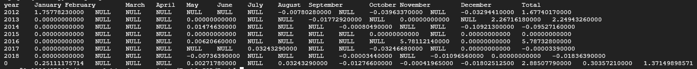

# Average fund statistics with MySQL


## Usage

```shell
bash run.sh -d {data_dir} (-oc|--open_close|-cc|--close_close) (-m|--month|-w|--day_of_week)
```

## Optional arguments

```shell
-oc, --open_close  - calculate average value from open rate to close rate
-cc, --close_close - calculate average value from close rate to close rate
-m, --month        - calculate average value by month
-w, --day_of_week  - calculate average value by day of week
```

## Example

all examples were carried out on test dataset

```shell
bash run.sh -d ../../data --open_close -m
```



```shell
bash run.sh -d ../../data --close_close -w
```

