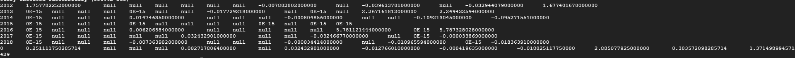

# Calculator of the average growth rate with Hive

## Description

## Usage

1) Setup database schema

```shell
bash setup/db_setup.sh [{data_dir}] (-i|--incremental|-f|--full) [-w|--without_load]

Optional arguments

-i --incremental INCREMENTAL    - choose this flag to perform incremental data load
-f --full FULL                  - choose this flag to perform full data load
-w --without_load WITHOUT_LOAD  - choose this flag not to load data
```

2) Load data

```shell
bash (manage_loading_process.sh|incremental_load_data.sh) {data_dir}

Optional arguments

manage_loading_process.sh     - run this script to load data without check checksum
internal_load_data.sh - run this script to load data with check checksum
```

3) Run procedures

```shell
bash run.sh (-m|--monthly|-w|--weekly) (-oc|--open_close|-cc|--close_close)

Optional arguments

-m --monthly MONTHLY          - monthly average fund
-w --weekly WEEKLY            - weekkly average fund
-oc --open_close OPEN_CLOSE   - open date equals to close date
-cc --close_close CLOSE_CLOSE - close date is before close date
```

## Requirements

1) Hadoop cluster with Hive 2.3.0 or newer
2) Python 3

## Example

```shell
bash run.sh -m -oc
```



```shell
bash run.sh -w -cc
```


